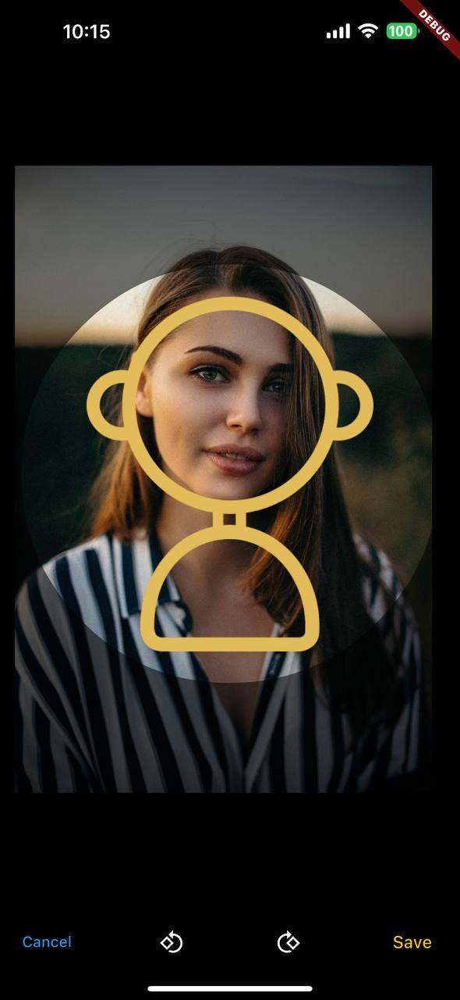

# My Image Cropper View (Working Title)

**This Flutter package is a fork of the `image_cropper_view` package. I modified the original package to add an overlay image feature to suit my needs. All credits belong to the original owner.**

## Original Package Details

- Original Package: [image_cropper_view](https://pub.dev/packages/image_cropper_view)
- Original GitHub Repo: [gliheng/image_cropper_view](https://github.com/gliheng/image_cropper_view)
- Author of the original repo: [gliheng](https://github.com/gliheng)
- License: MIT License (See [License](#license))

### Image Overlay Feature Modification

I've enhanced the functionality of this package by introducing a new feature: the ability to add an image overlay to the crop area. This modification enables users to superimpose another image atop the cropped image, providing additional customization and creative possibilities.

With this enhancement, the `overlayImage` parameter has been introduced to the `cropImage` function. By specifying the desired overlay image, developers can seamlessly incorporate overlays into their cropped images. For instance, you can overlay stickers, logos, or decorative elements onto the cropped image, enhancing its visual appeal and functionality.

This modification extends the versatility of the package, empowering developers to create more immersive and customized user experiences within their applications.



## Features

- Supports pan, zoom, rotate gestures to position your image
- Works on desktop, mouse wheel to zoom, ctrl + mouse wheel to rotate
- Only dart code included, no native dependency
- Configurable control buttons
- Support setting clip shape to either circle, rect, or rrect

## Getting Started

Begin utilizing My Image Cropper View by integrating it as a new route within your application, enabling seamless and efficient image cropping.

## Usage

Integrate the package by following these simple steps:

```dart
// Example usage of My Image Cropper View
Uint8List? result = await MyImageCropperView.cropImage(
  context: context,
  image: Image.file(imageFile),
  clipShape: ClipShape.circle,
  overlayImage: Image.asset("assets/smile.png"),
);
```
